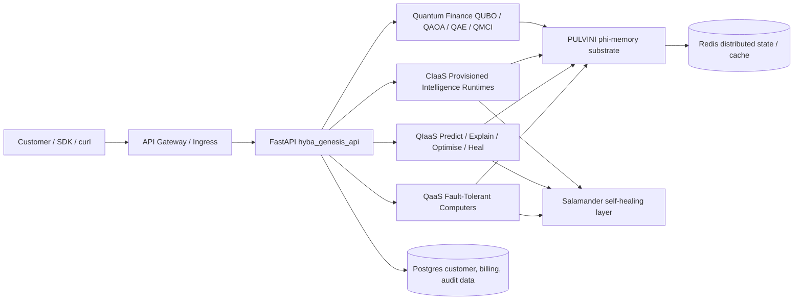

# HYBA System Architecture

## Runtime boundaries

- Mining is an internal validation substrate, not a customer product surface.
- QaaS, QIaaS, CIaaS, and Quantum Finance are customer-facing revenue surfaces.
- PULVINI and Salamander are shared internal substrate services used by product surfaces.
- Redis supports distributed state, response caching, idempotency, and coordination.
- Postgres is the intended durable system of record for tenants, billing, invoices, and audit trails.
