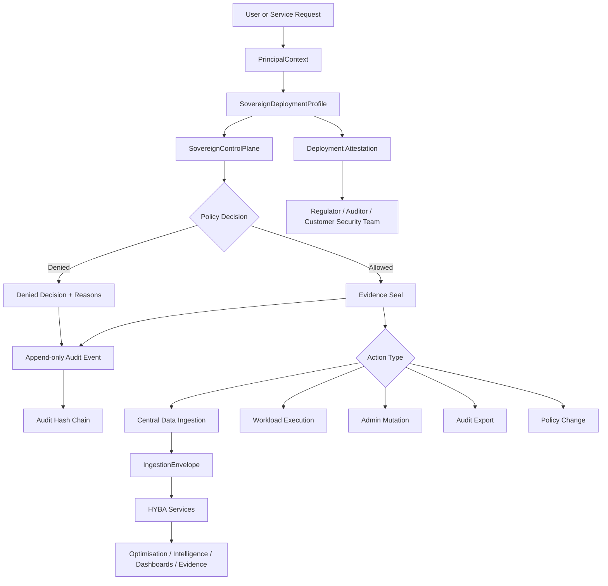
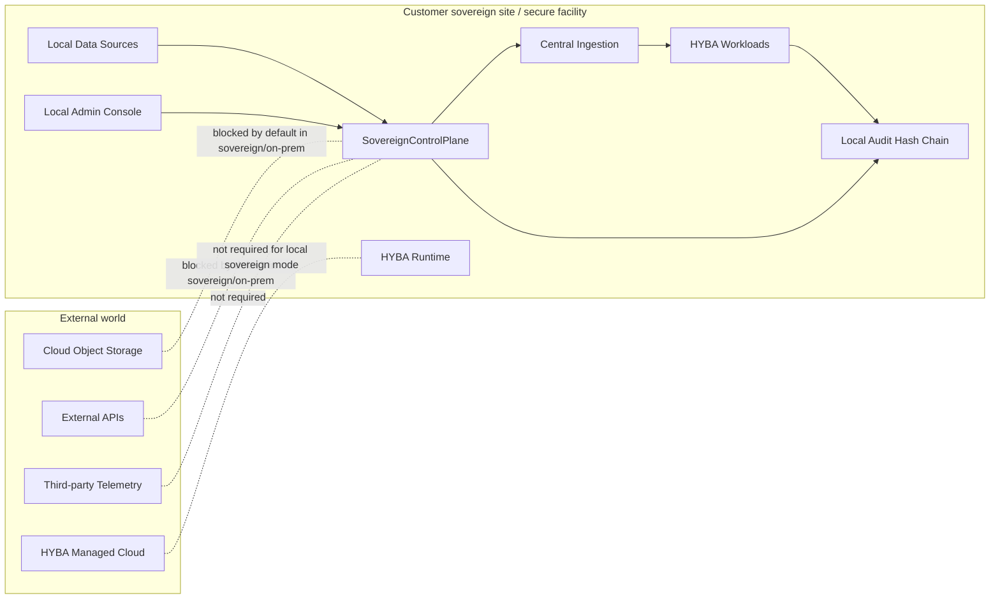
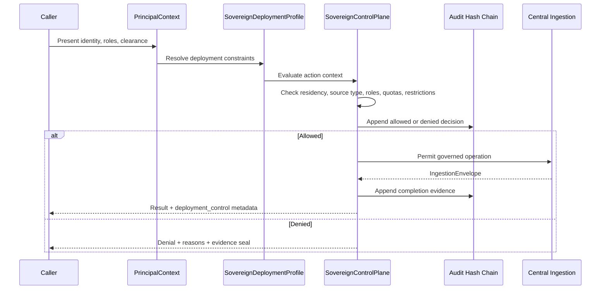

# HYBA Regulator-Grade Architecture Diagram

## Purpose

This document gives regulators, security reviewers, customer assurance teams, and sovereign-cloud onboarding teams a concise view of HYBA's governance boundary.

## Control-plane architecture



## Sovereign data-boundary view



## Regulator inspection points

| Inspection point | Question answered |
|---|---|
| `PrincipalContext` | Who is acting, with what role and clearance? |
| `SovereignDeploymentProfile` | Where is HYBA running, and which deployment restrictions apply? |
| `SovereignControlPlane` | Was the action allowed, denied, sealed, and audited? |
| Evidence seal | Can the decision be identified and verified? |
| Audit hash chain | Is the event sequence tamper-evident? |
| `IngestionEnvelope` | What was ingested, from where, under which lineage and quality report? |
| Deployment attestation | Can HYBA prove its active deployment posture? |

## Architecture claim

```text
HYBA separates deployment governance from workload logic.

Ingestion, workloads, and administrative actions do not execute merely because an endpoint was called. They pass through a local sovereign control plane that evaluates principal, deployment mode, source type, data residency, usage quota, admin privilege, and audit requirements before allowing execution.
```

## Control-plane sequence


